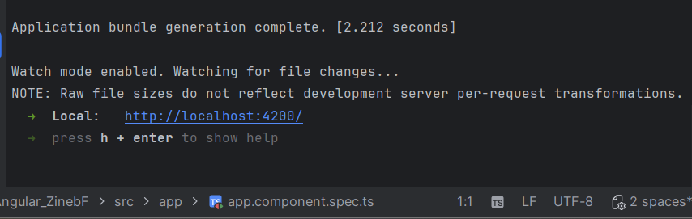
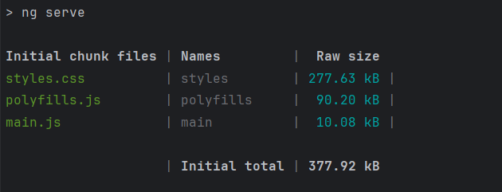
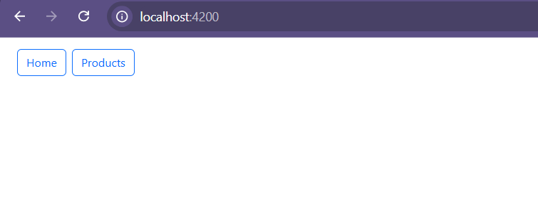
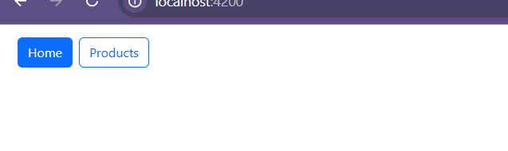
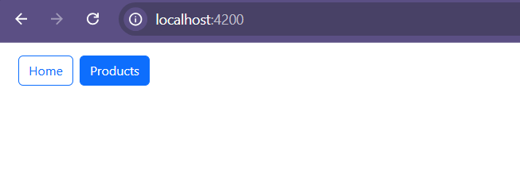
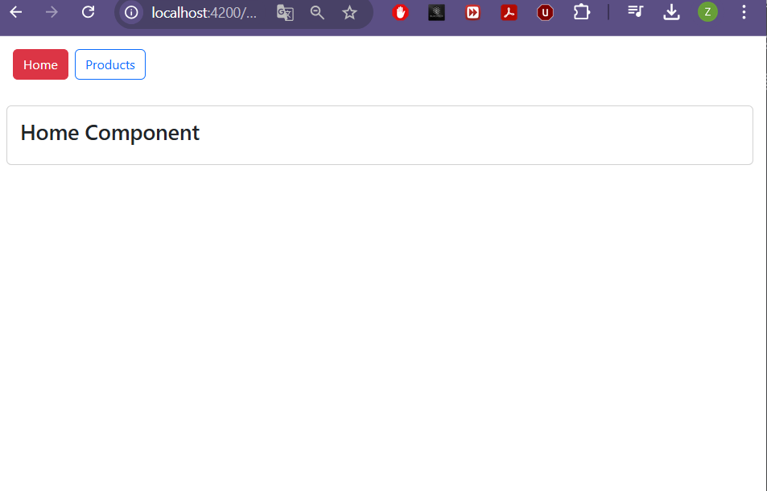
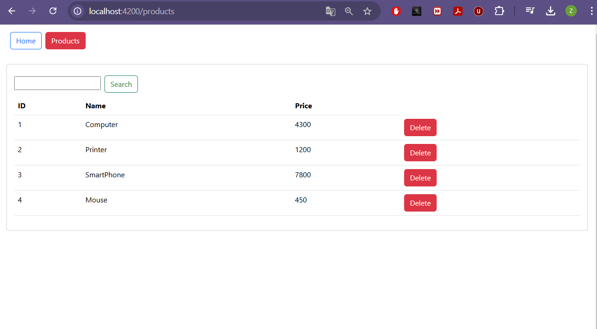
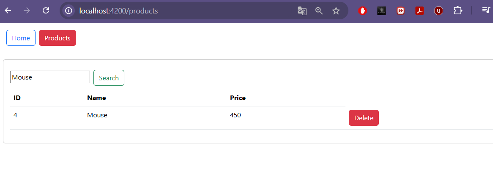
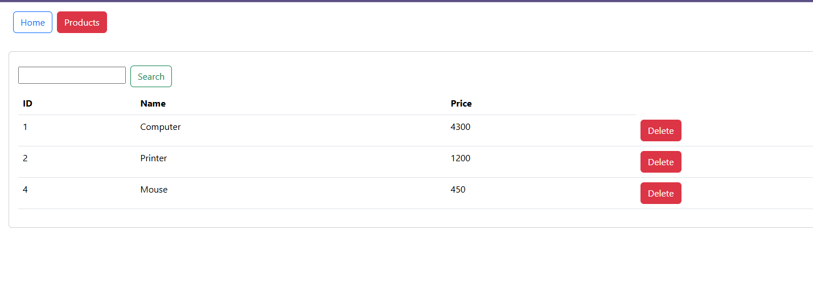

# Activité Pratique Angular : Application de Gestion des Produits en Angular

## Réalisé par : **Zineb Feth-Eddine**

### Introduction
Cette application Angular a été développée pour permettre la gestion des produits dans une interface simple et fluide. Elle permet de visualiser une liste de produits, d'ajouter de nouveaux produits et de gérer leur affichage grâce à une structure modulaire utilisant les composants Angular. Le projet a été conçu pour faciliter l'apprentissage et la mise en pratique de la gestion des états et de la navigation dans une application Angular.

L'application est divisée en plusieurs parties principales :
- **Page d'accueil** : Fournit un aperçu général de l'application.
- **Gestion des produits** : Permet d'afficher et de gérer les produits, y compris leurs informations détaillées.
## Fonctionnalités

L'application propose les fonctionnalités suivantes :

1. **Page d'accueil** :
   - Fournit un aperçu général de l'application.
   - Lien vers la section de gestion des produits.

2. **Gestion des produits** :
   - Afficher la liste des produits.
   - Supprimer un produit.
   - Chercher un produits

3. **Navigation fluide** :
   - Utilisation du module de routage Angular pour naviguer entre les pages.

4. **Interface utilisateur intuitive** :
   - Design simple et efficace pour une meilleure expérience utilisateur.

### Démarage du serveur

Voici les captures d'écran supplémentaires pour illustrer l'application en action, y compris le processus de démarrage du serveur de développement.

**Bundle de l'application** :  
     
   Cette capture montre la taille des fichiers générés après le démarrage de l'application avec `ng serve`.
   
**Démarrage du serveur de développement** :  
     
   Cette image montre la sortie de la commande `ng serve`, indiquant que l'application a démarré avec succès sur `localhost:4200`.

## Captures d'écran

Voici quelques captures d'écran réalisées lors du développement de l'application pour illustrer les différentes parties de l'application :

1. **Page d'accueil avec boutons** :  
     
   Cette capture montre la page d'accueil de l'application avec les boutons "Home" et "Products" en haut de la page. Ces boutons permettent de naviguer entre les différentes sections de l'application.

2. **Survol du bouton "Home"** :  
     
   Cette image montre l'effet de survol du bouton "Home". L'effet visuel indique que le bouton "Home" est interactif et prêt à être cliqué par l'utilisateur.

3. **Survol du bouton "Products"** :  
     
   Cette capture illustre le survol du bouton "Products". Comme pour le bouton "Home", l'effet visuel montre que l'utilisateur peut cliquer sur ce bouton pour accéder à la gestion des produits.

4. **Page d'accueil** :  
     
   Une autre vue de la page d'accueil de l'application, où l'utilisateur peut trouver des informations de navigation supplémentaires pour accéder à la gestion des produits et à d'autres sections.

5. **Gestion des produits - Liste des produits** :  
     
   Cette image montre la liste des produits dans l'application. L'utilisateur peut voir tous les produits actuellement enregistrés, avec des options (delete, search) pour interagir avec chaque produit.

6. **Gestion des produits - Chercher un produit** :  
     
   Cette capture montre l'interface de recherche où l'utilisateur peut saisir un nom de produit pour filtrer les résultats et trouver plus rapidement le produit recherché.

7. **Gestion des produits - Supprimer un produit** :  
     
   Cette image montre l'option de suppression d'un produit.

## Conclusion

Ce projet illustre la mise en œuvre des concepts fondamentaux d'Angular, tels que :
- La structure modulaire avec des composants réutilisables.
- La gestion des routes pour naviguer entre différentes pages.
- La gestion de l'état local pour manipuler les données de produits.

